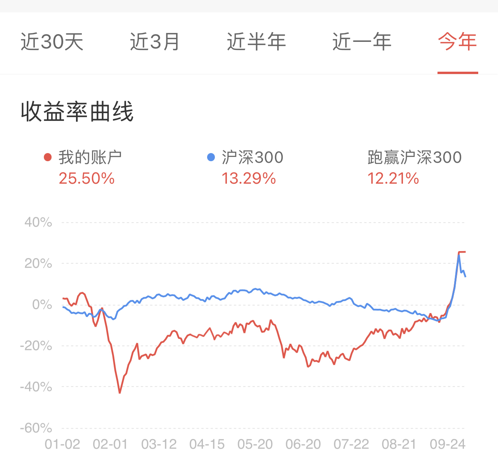

# 【CTBZStock】草台班子量化 

    
    
    
    

 
牛市昙花一现，量化穿越牛熊
  
大A就是一个巨大的草台班子
  

## 项目介绍
此项目基于券商交易、查询接口进行二次开发，以小市值量化策略为示例，进行A股量化模拟实盘与量化实盘（无回测功能），并提供生产、测试环境隔离方案。
您可以参考此项目，将您离线回测好的策略，轻松开启实盘。

## 功能
- 模拟实盘定期执行策略
- 实盘定期执行策略
- 飞书实时通知交易进展
- 获取实时股价数据
- 获取天级别基本面数据
- 支持接入更多掘金量化API、第三方数据API，自由开发

## 配置教程
- 由于券商客户端限制，本项目仅支持windows、windows server（支持windows云服务器）
- [模拟实盘配置攻略](doc/模拟实盘配置攻略.md)

## 实战成绩
- 我基于小市值魔改的策略，实盘收益如下（不出意外的话会持续更新最新收益，如果没更新那就是出意外了）

    
    
2024.1.1 ~ 2024.10.11 今年行情很奇葩，最大回撤干到快50%，差点中途放弃

## 声明
- 本项目不构成任何投资建议，不做股票推荐
- 本项目受众为业余量化爱好者，中低频交易，非专业投资，非高频量化
- 模拟实盘和实盘仍存在不少差异，实盘需谨慎，盈亏请自负

## 合作方
- [掘金量化](https://www.myquant.cn/)(模拟实盘、实盘都需要注册掘金量化账号)
- [万和证券](whzq.com.cn)(仅实盘需要开户，模拟实盘不需要)

## 联系我们
- QQ群 123155600   (验证消息填写 github 用户名，需要给本项目点STAR才可入群)

## 相关资料
- [掘金量化python api文档](https://www.myquant.cn/docs2/sdk/python/%E5%BF%AB%E9%80%9F%E5%BC%80%E5%A7%8B.html)
- [akshare 股市数据获取python三方库](https://github.com/akfamily/akshare)