# 模拟实盘简易上手文档

## 一、准备环节
- windows电脑或windows server服务器(支持云服务器)，跑通DEMO 2核2G即可
- [注册掘金量化账号](https://www.myquant.cn/)
- [万和掘金客户端下载](http://download.vanho.cn/download/juejin/Vanhogm.exe)
- [Python安装包下载](https://www.python.org/downloads/windows/)(版本推荐3.8～3.10)

## 二、安装
1. 在windows机器上安装万和掘金客户端，安装路径为"C:/Users/Administrator/AppData/Roaming/Vanho Goldminer3"(如果不是这个路径，在tool文件夹中修改相应文件路径即可)
2. 创建模拟实盘账户，取名为develop

    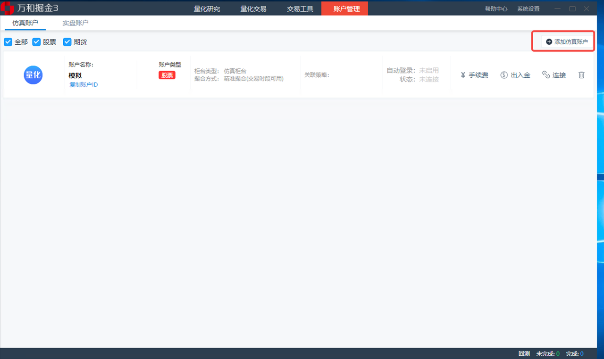

3. 创建策略，策略名称选择空策略，交易账号选择develop

    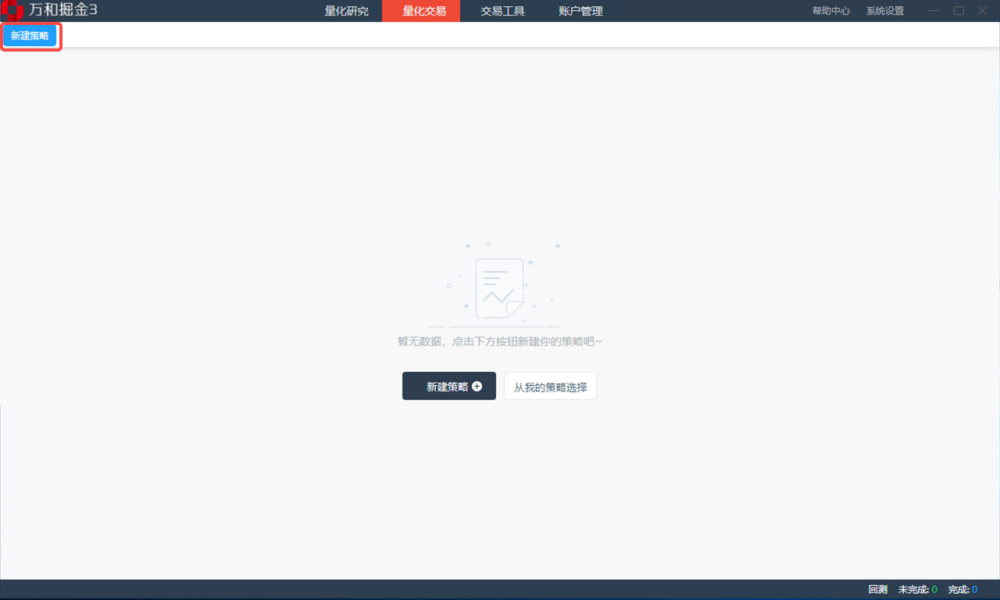  

    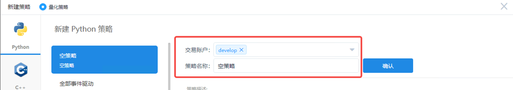

之后出现创建成功页面，此时需要记录strategy id和账户token (重要！)

    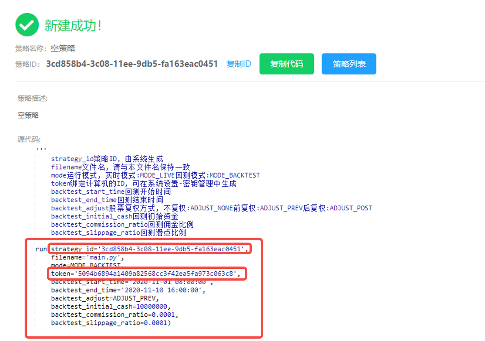

4. 安装Python    
5. [下载并安装Git](https://git-scm.com/download/win)
6. 添加ssh key，并下载本代码仓库，下载路径为"c/Users/Administrator/Desktop/stock/develop/RedStock"
7. 进入项目，切换至develop分支 
8. 修改项目配置文件 config/develop.py，将strategy id和token替换为上述记录的对应值 
9. 安装相关依赖 `pip install -r requirements.txt`，速度慢可以切换国内源

## 三、运行
运行使用windows自带的Task Scheduler，如果有更好的windows定时任务启动方案，可自行替换
1. 在Task Scheduler中创建任务，先选中左侧目录，不然之后定时任务会找不到

    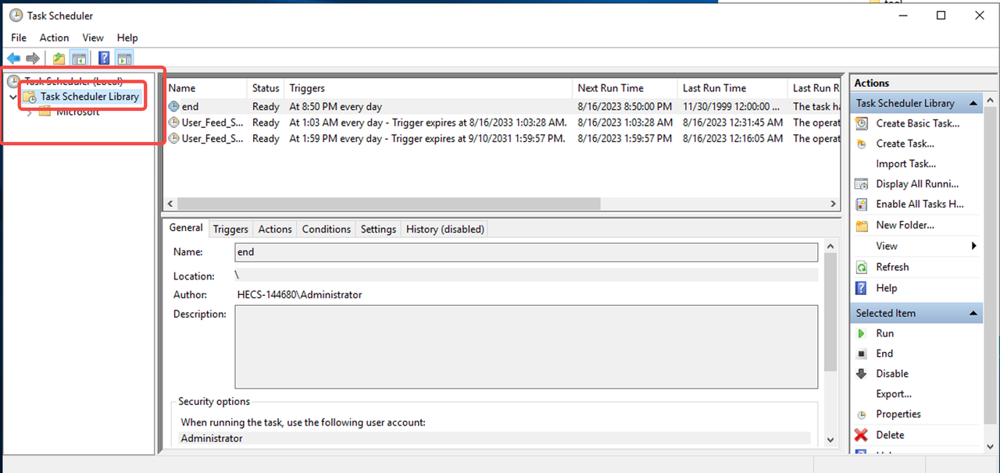

    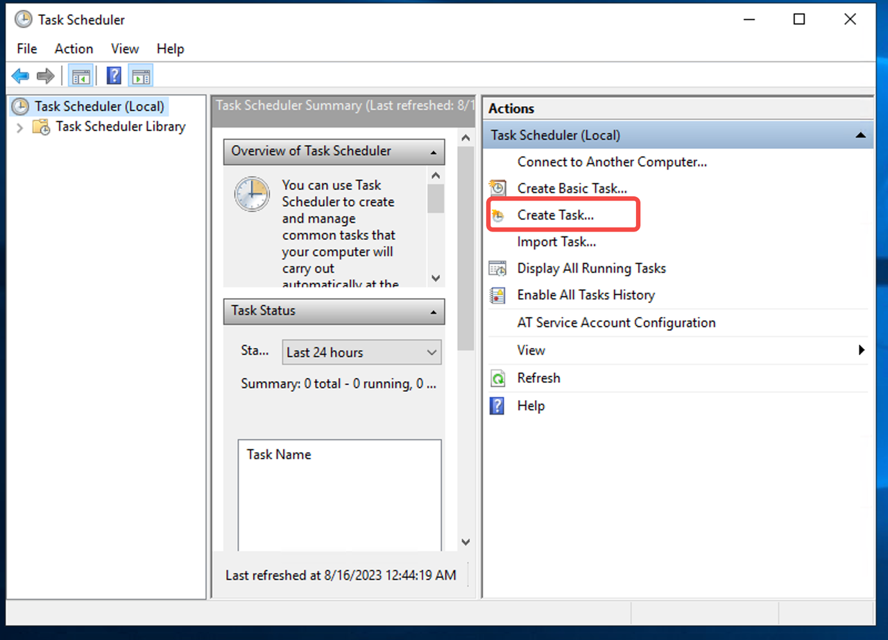

2. 创建任务：启动掘金客户端

    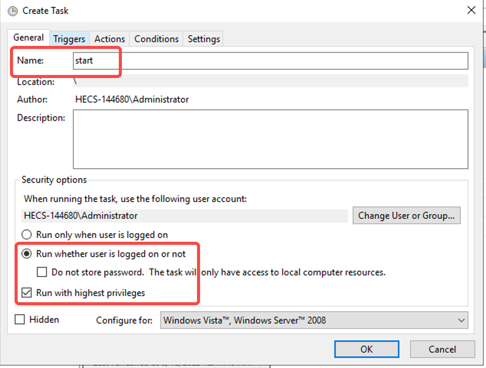
    
name随便填，勾选选项必须保持一致

    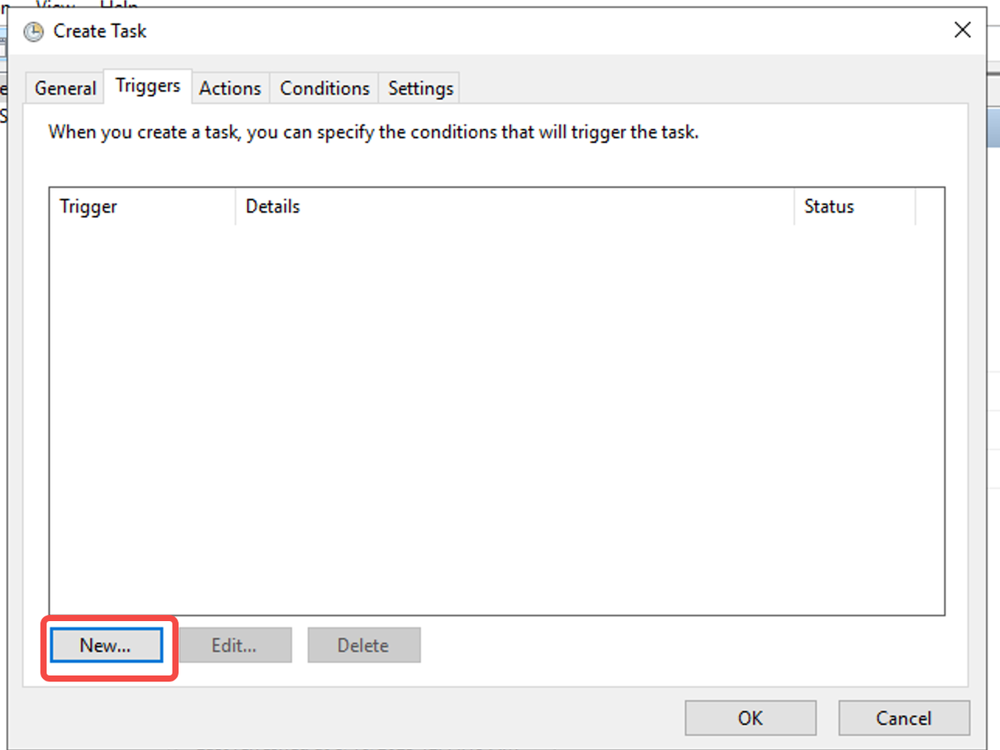
    
在trigger中new

    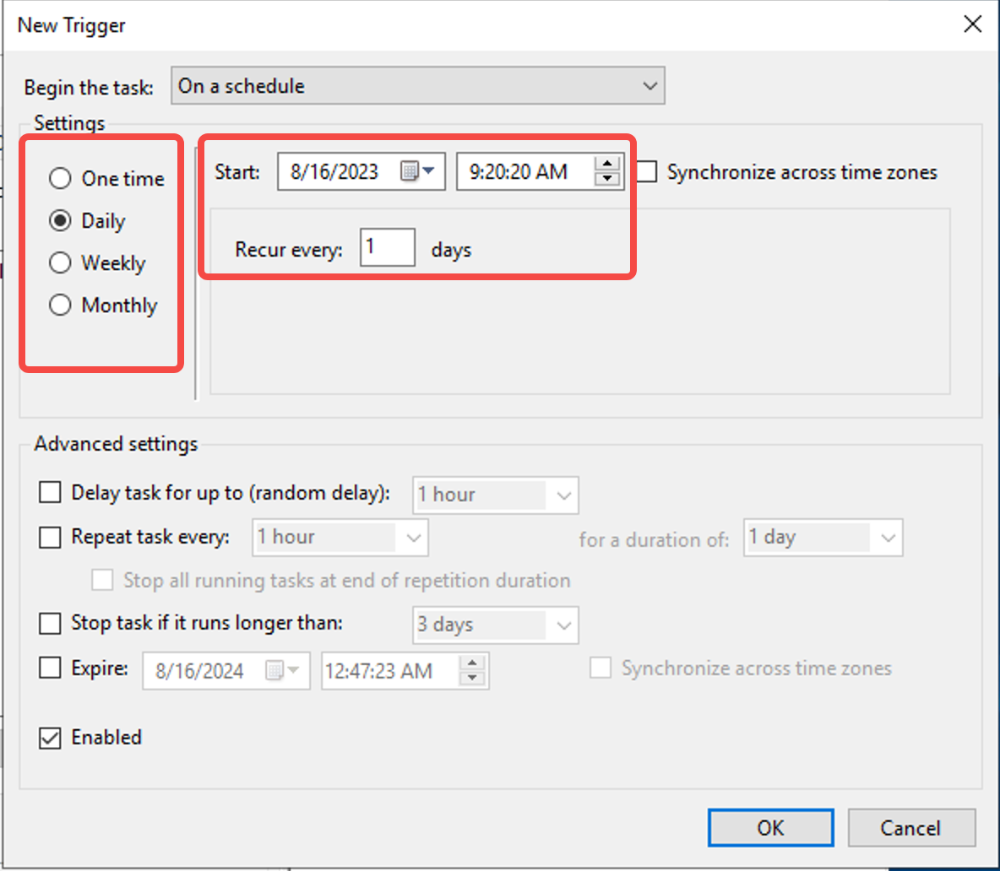
    
选择触发时间，每天上午9:20启动

    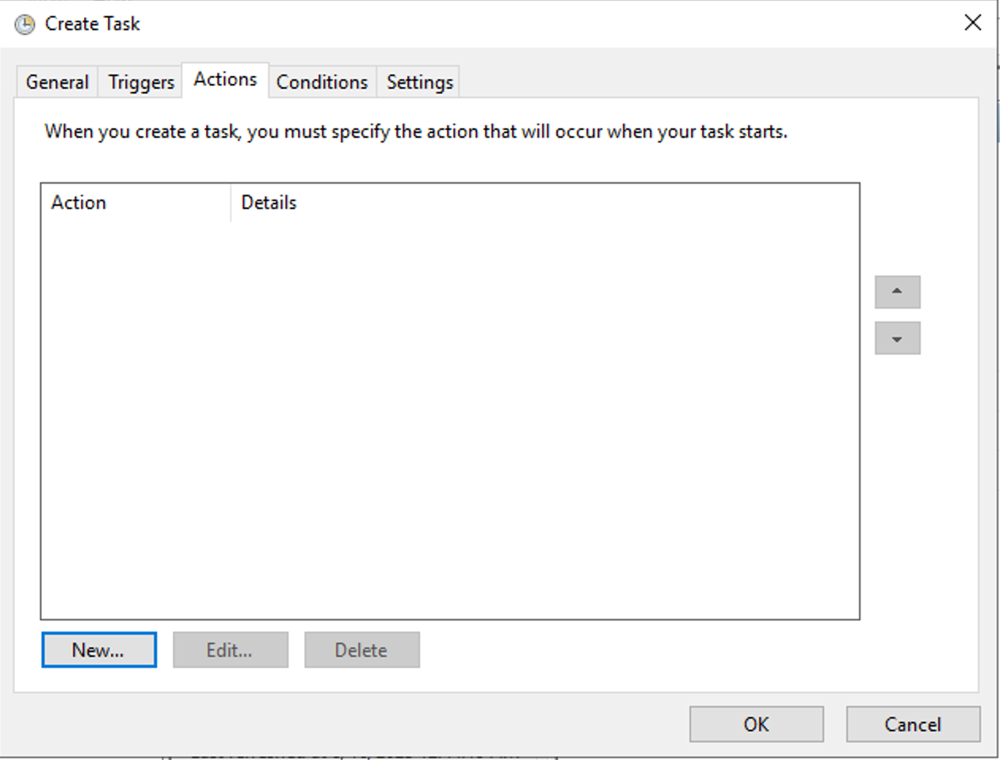
    
在Actions中new

    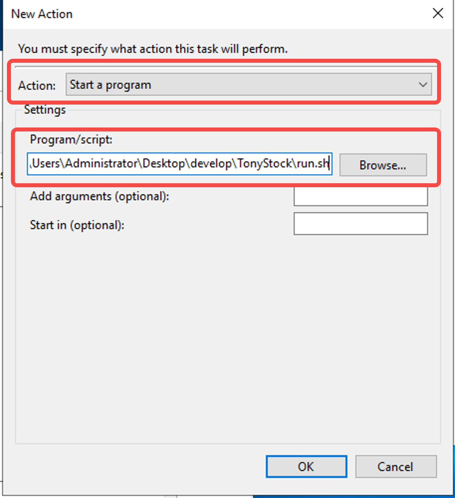
    
Action选择如图，路径选择项目代码中的tool/run_exe.sh

点击OK，生成任务

3. 创建任务：启动模拟实盘
同上述启动任务步骤，启动时间改为09:26:00 (根据策略可自定义)，启动脚本改为 tool/develop.sh

4. 创建任务：关闭所有任务与客户端
同上述启动任务步骤，启动时间改为08:00:00，启动路径改为 tool/shutdown.sh